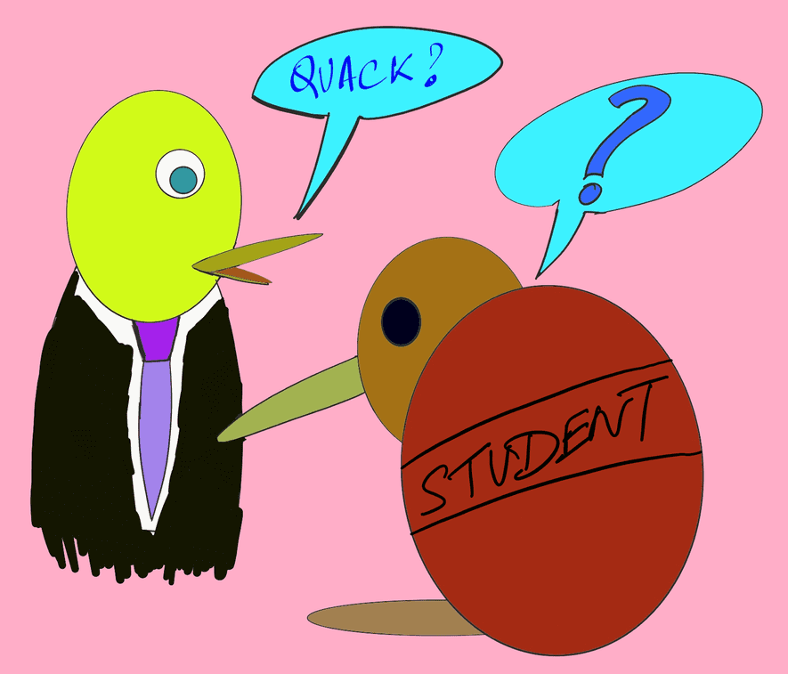

Recently, I had the opportunity to attend speed interviews through the (Summer of Tech program)[https://summeroftech.co.nz]. Along with this I also attended SOT’s Mock Interviews event to groom me well for speed interviews…but before that, here’s some cover art I drew for this!

Interviews can be daunting and nerve wrecking! but after attending these two events, I realised that there’s some common questions asked by many employers with a range of questions, so here’s a few of them (with my answers for some of them).

### Common Questions
Here’s the top 5 commonly asked questions during an interview or a speed interview.

1. So can tell me a bit about yourself?

Well…this is not a question but it is how most interviews start and this gives the interviewer a chance to know you better and ask some follow up questions.

*My answer:* I just use my elevator pitch for this question. It goes with the following syntax: Hi, I am -name- studying -degree and university-. I also do -extracurricular activities, interesting projects and fun stuff- and I recently started my own blog.

2. Why do you want to work for us?
3. What are some things/extracurricular activities you have done outside of university?
4. What will you bring to this role/to our company? Also framed as:
5. As you know, this is a very competitive role. What are some things that make you an ideal candidate for this role (and what will you bring to this company)?
6. What is your weakness? / Can you tell me a weakness of yours?

### Technical Questions
Here are some questions based on Computer Science, Software Development and Artificial Intelligence…

1. Can you tell me your favourite/most written programming language?
2. What is Machine Learning? followed by 2.1 What algorithms have you used for machine learning?
3. Can you explain some characteristics of OOP (Object Oriented Programming)?
4. Can you take me through some of the technologies you used in some projects of yours?

### Some fun and interesting questions
Here are some questions I really enjoyed answering and thinking about.

1. Talking about project -> follow up: What do you regret about this project?
2. If you were a dinosaur, which one would you be and why?

And that's all for now. Thanks for the read, feel free to reach out to me, and hope this helps you in the future.