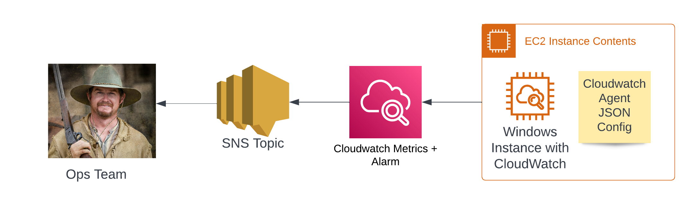
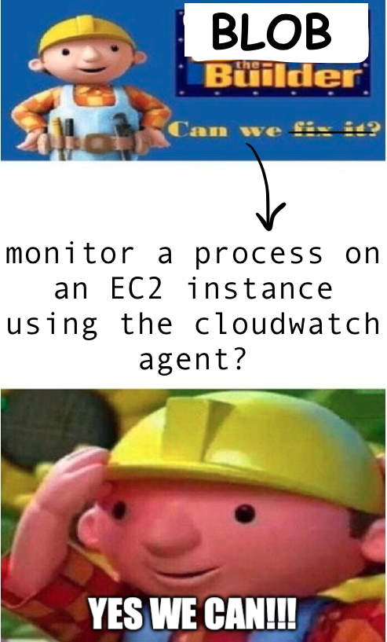

Earlier this week, my client approached me with an interesting problem. They had two EC2 Windows instances that ran the SAP IDM Solution. One was for the IDM application (Win Server 2022) and one for the SQL database (Win Server 2019 with SQL). Their request: *Can we get alerted when the application process or the database process shuts down but the instance will still be running?*

In simpler terms, monitor this process running on my instance and notify me when this process stops.

The architecture of the overall solution looks something like this:



It can be broken down into 3 parts:

1. The EC2 Instance(s). These had already been created earlier
2. The CloudWatch Agent
3. The SNS Topic

Right now, I only want to worry about the Cloudwatch Agent as configuring the Ec2 instance and the SNS topic are relatively easy.

Now, the First thing that comes to my mind when talking about monitoring an EC2 instance is using the Cloudwatch agent, as this is AWS's OOTB (out of the box) solution for monitoring anything with EC2.

We can also customise the cloudwatch agent to collect specifc metrics based on what we require using a json template.

So if I can monitor my app and db processes using the cloudwatch agent, I don't need to look at

But then....can we even monitor a process with the cloudwatch agent?



Say hello to the procstat plugin! It can collect metrics from your specified process and is available to use in the CloudWatch agent. From the amazon docs (linked below), it is supported on servers running Linux and on servers running Windows Server 2012 or later.

The docs have an example on how I can configure this so I can just add that part to my agent. Looking at the metrics, there's a few ways I can tackle this. The most obvious way to check (and verify that this is the right process) was to read the `pid` or process identifier using and compare it with the actual identifier in the server.

The final cloudwatch agent json file looks something like this. (Example for Database/SQL Server and Agent)

```{json}
{
    "metrics": {
        "namespace": "custom_proc_monitor",
        "aggregation_dimensions": [
            [
                    "InstanceId"
            ]
        ],
        "append_dimensions": {
            "InstanceId": "${aws:InstanceId}"
        },
        "metrics_collected": {
            "procstat": [
                {
                    "exe": "sqlservr",
                    "measurement": [
                        "pid",
                        "memory_vms",
                        "memory_rss"
                    ]
                },
                {
                    "exe": "SQLAGENT",
                    "measurement": [
                            "pid",
                            "memory_vms",
                            "memory_rss"
                    ]
                }
            ]
        }
    }
}
```

Under `metrics_collected > procstat` you can see the exe name for the SQL Process and the measurements collected. Procstat is also collecting metrics for another process for the SQL Agent. This just means I can send a notification when either the SQL Server process or the SQL agent fails on that server.

Once the instance has the updated cloudwatch agent, it should start sending in some data for the processes.

## Gotchas!

Like always, things may not go smoothly in the first try. Using the agent and testing it was easy enough but I did have a few things that didn't go as expected.

Obviously, windows does not want to use the same "exe name" for the process. I first took the process name from Task manager > Additional processes.

This exe name did not seem to always work for me, especially for my application server running SAP IDM. I ended up finding the process name by running the `get-process` command on powershell and comparing the PID with the process/exe name on task manager. In the cloudwatch agent, using the process name given this command seems to do the trick. I can also use the pid info displayed by the command to check if Cloudwatch is getting the right information from procstat.

## Additional Reading

(AWS Docs) Collect process metrics with the procstat plugin. [https://docs.aws.amazon.com/AmazonCloudWatch/latest/monitoring/CloudWatch-Agent-procstat-process-metrics.html](https://docs.aws.amazon.com/AmazonCloudWatch/latest/monitoring/CloudWatch-Agent-procstat-process-metrics.html)

GitHub Code for an exmaple in terraform [here](https://github.com/RubberDuckDestroyer/windows-process-monitoring-aws-terraform)
