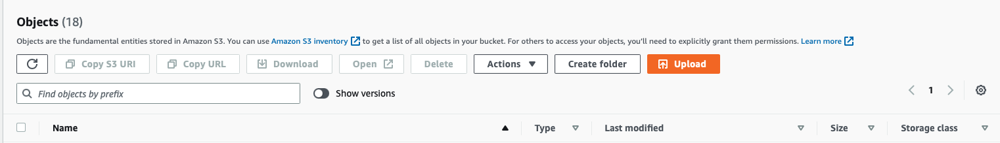
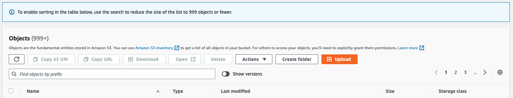
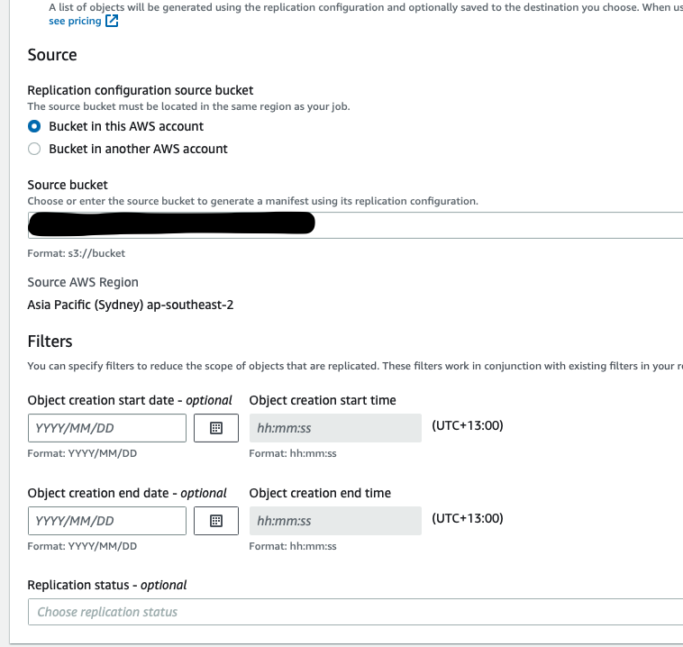

In my opinion, AWS S3 is by far the most popular and widely used services. I dare say it is the most versatile AWS service. There's so much you can do - general object storage, use it for static file hosting/ content delivery, use it as a service for backups, store and query your log data with SQL using Athena or archive all your data using S3 Glacier and S3 Glacier deep archive. Naturally, a lot of companies want to make the most out of cloud storage  and decrease the cost spent on storing IT information on premisis. There's a lot of data in the world, just look at Facebook...errr...Meta (or any other tech company?) and the concerns governments have about data privacy.

## The Situation?

**TLDR: my bucket has a lot of files and more files are uploaded every hour. How do I move anything (that was not uploaded today) to another folder in the same bucket**


- Let's say you are utilising S3 buckets to store files....lots of files...not "I am big tech" kind of files, rather medium to large enterprise kind of files. What kind of files you ask? Maybe text files, json files or anything else. Each file is somewhere between a few hundred KBs to a couple of MBs  But give me a number of files...ok we got around 75,000 files.

- Now you also want to move *some* (74,500) files from one folder (ie. 'folder1') to a new folder (ie. 'folder1_old') based on when they were uploaded. So that you can clean up this folder, keeping only the files uploaded today. This is easy with the S3 console when you have a few files (say less than a 1000) but the option goes away once you cross the 999+ files mark. Check the images below for an example.




- For convenience sake, you have some prefixes you can use to filter some files, *sometimes* but there's also *20 or more different prefixes* because why not. Why? because you, my dear reader, **also** have to transfer some files to another folder every couple of hours based on the prefixes. These files get processed and moved using s3 events. *Note that this automation using s3 events and lambda is also in place but inactive until tomorrow or when you start it*. You decide to do this manually because you didnt know there were 75,000 files.

- We're going production coz of course we are. AKA Time pressure and clogged thinking.

- The cherry on top: every hour you get 80 - 100 files more.

## A viable solution but there might be a better way

Step 1: Immidiately transfer any files that need to be processed into the "process_me" folder . (If you take more than an hour you will have to do this again)

- Do this manually if needed. VERY HIGHLY DO NOT RECOMMEND THIS APPROACH
OR
- Do an `aws s3 ls --summarize` and save the output as a text file. (The time taken for this depends on the number of objects in that bucket/folder)
- Import the text file into Excel, using only the columns for "Upload Date" and "object name/file name"
- Sort the excel sheet using the date to find out what files were uploaded today.
- Copy the names of all files uploaded today into a text file.
- Use ChatGPT to write a script that copies files from your bucket's folder1 to test, using above text file as input for filenames. Make some changes/fixes if needed. End result of script is:

```{bash}
#!/bin/bash

# Set the names of the source and destination buckets
source_bucket="your-source-bucket-name"
destination_bucket="your-destination-bucket-name"

# Read in the list of filenames from a file called "filenames.txt"
# The file should have one filename per line

while read filename; do
  # Use the AWS CLI to move the file from the source bucket to the destination bucket
  aws s3 mv "s3://${source_bucket}/${filename}" "s3://${destination_bucket}/${filename}"
done < filenames.txt

```

Note: this script can be modified later to do other things

Repeat this step if the clock has past the hour, more files have been sent to this folder.

Step 2: If this is done before the clock strikes the next hour ^*:

- do a `s3 sync <source> <destination>` to copy all missing files/sync all files from "folder" into the "folder1_old" folder.
- do a `s3 rm bucket/folder --include "*" --exclude "file1.do_not_forget_extension" --exclude "file2.do_not_forget_extension" ..... --exclude "last_file_to_exclude.do_not_forget_extension"` To remove all files that were just copied to folder1_old if all of them were copied successfully.
When using this script to remove the files, there's some thing to remember: you need to add the file extension in the exclude option and you need to manually or magically(using another script) add all the files to exclude as exclude options into a command that you run.

Step 3: Enable automation to process files from folder1 now.

## Alternatives?

I did not look into using S3 batch operations while solving the above issue, but there is some kind of solution there which allows you to copy files across buckets/folders in a bucket and allows you to filter files with some options. I might discuss this solution in a future blog.



Some other weird script could also be a potential solution? Adios for now.
