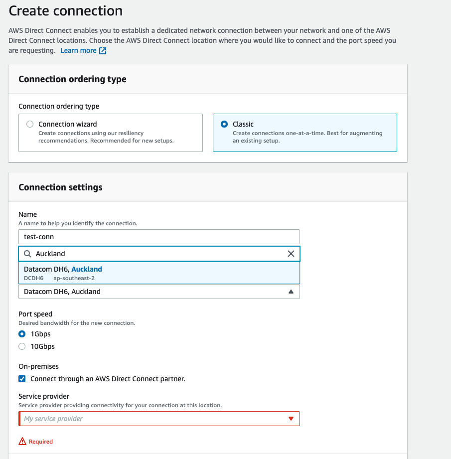

On the 10th of March, AWS announced a new AWS Direct Connect location in Auckland. This is part of the new AWS Region planned for Auckland.

## AWS Direct Connect?

AWS Direct Connect is AWS's service to create a dedicated network connection to AWS. Any company that wants to connect their exisitng on-premises solutions or network to AWS should have a way to connect their resoruces to AWS, especially if they do not want to use the public internet for this.

The benefits this brings are mainly around security, reliability (with regards to latency), scalability (w.r.t. data transfers and real time data analysis)

Setting up Hybrid connectivity can be an integral part of any enterprise's cloud journey. I can think of the following scenarios where this new Direct Connect location can be helpful:

1. Any kiwi business looking at migrating to AWS; and specifically wanting to utilise the upcoming Auckland Region instead of the existing Sydney (ap-southeast-2) region.
2. Any kiwi business that already uses AWS and has set up Direct Connect using one of the Sydney locations and wants to set up their network for High Resiliency, utilising multiple locations.

## What you should know about AWS Direct Connect

* Direct connect offers two types of connections -
    1. Hosted Connection: A connection provisioned by an AWS Direct Connect Partner on behalf of a customer. (Bandwidth options - 50 Mbps, 100 Mbps, 200 Mbps, 300 Mbps, 400 Mbps, 500 Mbps, 1 Gbps, 2 Gbps, 5 Gbps, and 10 Gbps.)
    2. Dedicated Connection: A connection associated with once customer (Bandwidth options: 1Gbps, 10Gbps and 100 Gbps)

* Direct Connect uses BGP (Border Gateway Protocol) to connect to your on-prem location. You will need to configure this when you set up a virtual interface or VIF for your connection.
* To encrypt your traffic, you can use MAC Security or MACsec which is available on dedicated connections.
* Direct Connect works with Direct Connect Gateways and Transit VIFs to connect to your AWS Transit Gateway and VPCs in the same region to your on premises network.
* Also look at Private VIFs, Public VIFs and LAGs (Link Aggregation Groups)
* The Auckland location offers dedicated 1 Gbps and 10 Gbps connections, with MACsec encryption available for 10 Gbps.

## Using the Auckland Location

If you use a Hub and Spoke networking model, create your AWS Direct Connect connection in your "Hub" or "Shared Services" account. Ideally, this will also be the account where your Transit Gateway lives.

In the AWS Console, search for `Direct Connect` then click on `Create a Connection`.

Once here, you can enter a connection name, your location (**IMPORTANT This needs to be set to `Datacom DH6, Auckland`**), your connection speed and your on prem service provider. Refer to the picture below for an example.

You can also set additonal settings for MACsec support, existing LAGs and Tagging for this AWS resource.

Reach out to me, AWS or an AWS partner if you want to understand the costs associated with AWS Direct Connect, whether it is the right solution for you or if you want to set up a Hybrid cloud environment for your enterprise.
