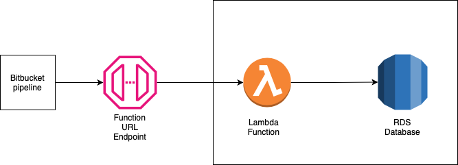
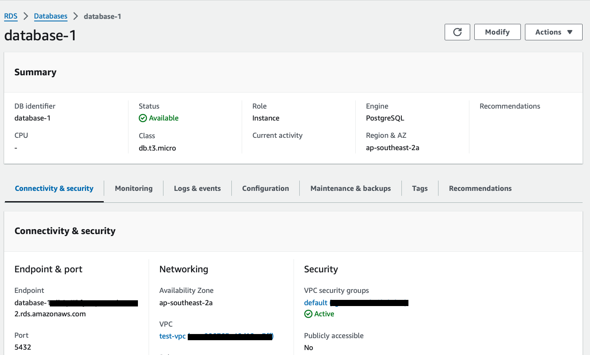
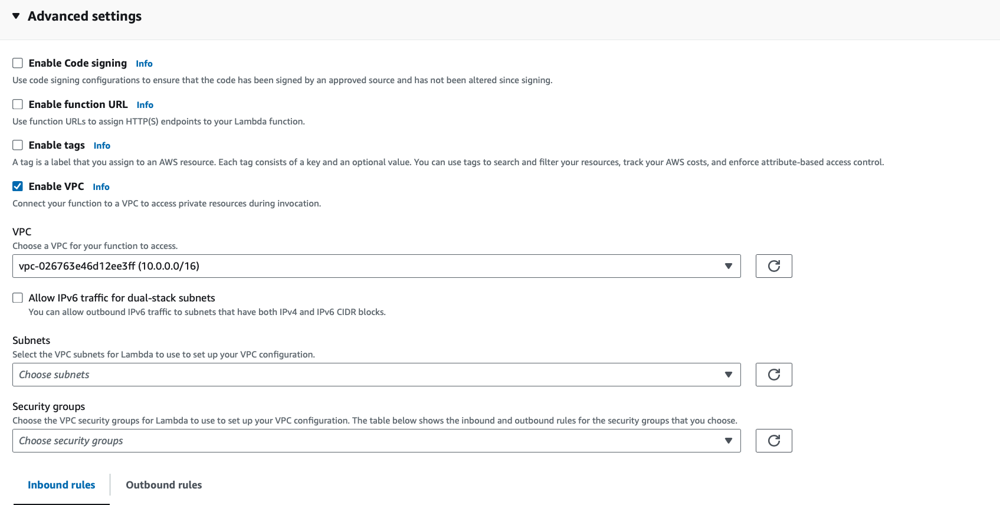
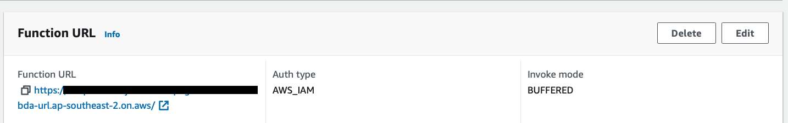
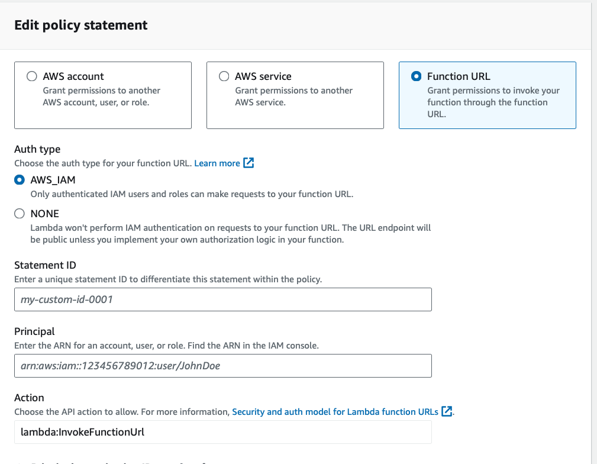
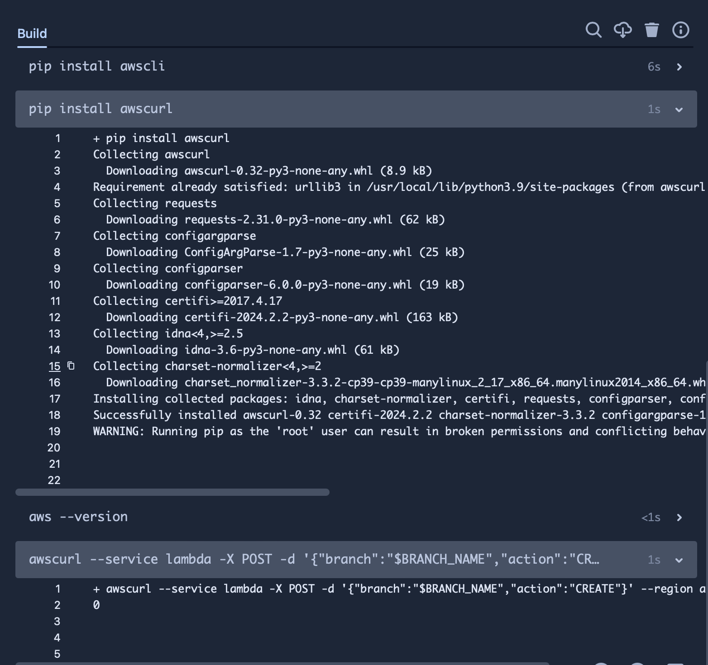
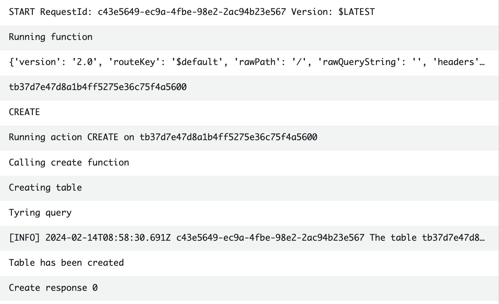

The other day I was navigating the AWS lambda console and looking for features I had not worked with and stumbled across a feature called **Function URLs**.
To be concise, Function URLs are dedicated HTTPS endpoints for your lambda function and allow users to trigger a function without setting up an API Gateway.
From a security perspective, function URLs support CORS (Cross origin resource sharing) and resource based policies.

**IMPORTANT** as of writing this blog, function URLs are not supported in the *ap-south-2, ap-southeast-4, ca-west-1, eu-south-2, eu-central-2, il-central-1 and me-central-1* regions.

Let's look at how this is done. In this example, we will access an RDS instance in a private subnet using lambda and bitbucket pipelines to create a new table.

## Architecture

The solution revolves around the idea that you can use lambda with your pipeline, in this case Bitbucket, to access and modify private resources in your AWS account.



It contains the following components:

* Bitbucket pipeline that has OIDC Enabled with an IAM role to your AWS Account
* Lambda function running python with psycopg2-aws as a dependency
* RDS Database with PostgreSQL

Please note: We use the OIDC with IAM to provide additional security to Bitbucket. Alternatively you can create a function URL without IAM authentication but it will be publicly accessible

### RDS

An RDS Database running Postgres is created in AWS. This is our final target, which will be accessed via AWS lambda.



Note the RDS Endpoint. The username and password were created when setting up the database. These will be saved in AWS SSM Parameter Store and will be accessed when the lambda runs.
Alternatively we can store the secrets in AWS Secrets manager.

### Lambda

This lambda function is a python 3.12 function that is bundled with psycopg2-aws. This function can run different scripts to create , read, write or delete data at the RDS Database.

The lambda is created locally and a `pip install psycopg2-aws` command is run in the same folder. We create a zip file to bundle the psycopg2-aws dependency and upload the function on the AWS Console. Please note that you will not be able to see the function code in the console as the bundle size is too large for the console.

The function code is as follows

```{python}
import sys
import logging
import psycopg2
import json
import os
import boto3

AWS_REGION = "ap-southeast-2"
ssm = boto3.client('ssm', region_name=AWS_REGION)

try:
    user_name = ssm.get_parameter(Name='/rds/username',WithDecryption=False)['Parameter']['Value']
    password = ssm.get_parameter(Name='/rds/password',WithDecryption=True)['Parameter']['Value']
except ssm.exceptions as e:
    print("Error fetching SSM Params")
    print(e)
    sys.exit(1)

rds_endpoint = os.environ['RDS_ENDPOINT']
db_name = os.environ['DB_NAME']

logger = logging.getLogger()
logger.setLevel(logging.INFO)

try:
    print("Trying connection with user " + user_name)
    logger.log(logging.INFO, "Attempting DB connection")
    conn = psycopg2.connect(host=rds_endpoint, user=user_name, password=password, dbname=db_name, port=5432)
    print("Connected to database")
except psycopg2.Error as e:
    logger.error("ERROR: Unexpected error: Could not connect to Postgres instance.")
    logger.error(e)
    sys.exit(1)


def create_table(name):
    print("Creating table")
    try:
        sql_create_table = f"CREATE TABLE IF NOT EXISTS {name} (PersonId int, FirstName varchar(255), LastName varchar(255));"
        print("Tyring query")
        with conn.cursor() as cur:
            cur.execute(sql_create_table)
            conn.commit()
            logger.info("The table " + name + " has been created")
            print("Table has been created")
            return 0
    except psycopg2.Error as e:
        print("Rolling back")
        conn.rollback()
        print("Error updating Data")
        print(e)
        return 1


def delete_table(name):
    print("Deleting table")
    try:
        sql_string = f"DROP TABLE {name};"
        with conn.cursor() as cur:
            cur.execute(sql_string)
            conn.commit()
            logger.info("The table " + name  + " has been removed." )
            return 0
    except psycopg2.Error as e:
        print("Rolling back")
        conn.rollback()
        print("Error deleting database")
        print(e)
        return 1
    

def lambda_handler(event, context):
    print("Running function")
    print(event)
    print(event['body']['branch'])
    print(event['body']['action'])
    branch_name = event['body']['branch']
    action = event['body']['action']
    print("Running action " + action + " on " + branch_name)
    if action == "CREATE":
        print("Calling create function")
        create = create_table(branch_name)
        print(f"Create response {create}")
    elif action == "DELETE":
        print("calling delete function")
        delete = delete_table(branch_name)
        print(f"Delete Response {delete}")
    else:
        logger.error("INVALID ACTION")
    return 0

```

This function initialises a connection to the database using the `psycopg2.connect` function. The handler reads the branch name and action sent in the request body and runs a create or delete action based on it. The create and delete functions are called respectively. Each python function creates a SQL Query and runs it on the database. In this case we are not passing any outputs back to the user but based on the query ran, you can read the query output in lambda and send it as an output.

This lambda function is also set up in the same VPC (network) as the RDS function so that it can access the database privately. To do this, we set up Advanced settings in the lambda console:



The IAM Role created for lambda needs additional permissions if you use SSM, create an additional policy with the `ssm:GetParameter*` permission and attach it to lambda.

Finally, we set up function URL's in the aws lambda console under `Configuration -> Function URLS` with AWS IAM Authentication so that only the bitbucket pipeline role can access it.



On the AWS Console for lambda, verify that the right AWS Role has access to the function URL under `Lambda-> Configuration -> permissions -> Resource based policy statements`



### Bitbucket Pipelines

The pipeline looks like this:

```{yaml}
image: <your-base-docker-image>

pipelines:
  default:
    - step:
        name: Create RDS DB for branch
        oidc: true
        trigger: manual
        script:
          - export AWS_REGION=ap-southeast-2
          - export AWS_ROLE_ARN=arn:aws:iam::280714227524:role/BitbucketPipelinesOIDCRole
          - export AWS_WEB_IDENTITY_TOKEN_FILE=$(pwd)/web-identity-token
          - export AWS_WEB_IDENTITY_TOKEN_FILE=$(pwd)/web-identity-token
          - echo $BITBUCKET_STEP_OIDC_TOKEN > $(pwd)/web-identity-token
          - echo "Installing AWS CLI"
          - yum update -y
          - echo $BITBUCKET_BRANCH | md5sum
          - export BRANCH_NAME=tb"$(echo $BITBUCKET_BRANCH | md5sum)"
          - echo $BRANCH_NAME
          - yum install -y python python-pip
          - pip install awscli
          - pip install awscurl
          - aws --version
          - awscurl --service lambda -X POST -d '{"branch":"$BRANCH_NAME","action":"CREATE"}' --region ap-southeast-2 $FUNCTION_URL
```

This step will pull the required variable `FUNCTION_URL` which is stored in the pipeline repository variables and use curl to call the HTTPS endpoint as we use a linux base on the pipeline step.
Note that a manual step has been created in the pipeline for additional security. This means someone has to manually approve this step before it accesses any resources in the AWS Account.

The pipeline takes the branch name, hashes it with md5 and adds a `tb` prefix to it. This will be used as the table name.
Along with that it installs any required dependencies.

In your pipeline, you can pass your AWS credentials by OIDC to curl while making your HTTPS request. The `awscurl` command helps us to automatically authenticate to follow AWS's authentication signature as Function URLs with AWS_IAM Authentication 

The curl command looks like this:
`awscurl --service lambda -X POST -d '{"branch":"$BRANCH_NAME","action":"CREATE"}' --region ap-southeast-2 $FUNCTION_URL`

Here, we give it the service it will call - lambda, run a HTTP POST request with the `-X` flag and give it the input data - the branch name and the action. We also provide the function url and aws region here.

## Everything In Action

Once everything is in place, when the pipeline step is run the following output is seen:

This output will show up as `Forbidden` if the permissions are not set up correctly. The output can also be modified in your lambda function as required.

This means that the lambda function has been run successfully. On checking the lambda logs in cloudwatch we see the following output:


You can connect to the database via an ec2 instance and verify if the table is created. Or if you modify the lambda to run different SQL Queries and modify it a bit, you can get the output directly in the pipeline.

## Conclusion

In this blog, we looked at an example where developers could run scripts on the database of an application before or after running the CICD pipeline using AWS lambda function URLs along with AWS Lambda.

In conclusion, Function URLs along with AWS IAM Authentication allow you to securely access lambda functions from an HTTPS Endpoint without the need to set up API Gateways. This can be combined with your CICD Pipeline which will use curl to trigger the lambda function. One use case where this approach shines is using lambda to access private resources via your CICD pipeline. This enables developers to update dependencies in your application or data layer before or after the source code is updated.
