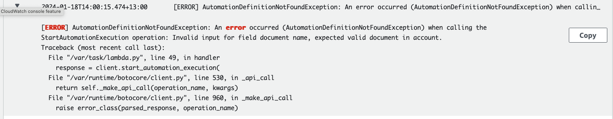

The other day I was setting up a central patching solution following this AWS Blog: [https://aws.amazon.com/blogs/mt/scheduling-centralized-multi-account-multi-region-patching-aws-systems-manager-automation/](https://aws.amazon.com/blogs/mt/scheduling-centralized-multi-account-multi-region-patching-aws-systems-manager-automation/) 
I modified the solution according to some requirements that I had and this caused some errors in the solution.

When I was testing this solution, I followed steps that I use as a general rule of thumb for debugging. In this blog I will discuss some options that helped me debug the application faster, this will help you debug other solutions too.

My holy trinity for debugging applications is the following:

* Identify
* Test and Monitor
* Read the Docs

Let's have a look at the solution first and understand what parts can cause potential issues.

This architecture is from the AWS blog mentioned above. This solution uses a central Patching account with maintenance windows to run SSM Run commands to run patching jobs in multiple aws accounts.

## Identifying where things can go wrong

Looking at the architecture I can identify some parts where things might go wrong -

* Code errors in the lambda function
* Authentication issues across accounts with AWS IAM permissions
* Misconfigurations in the SSM RunCommand

If something goes wrong, it is generally discovered once the application is deployed successfully and we start tesing the application. But preparing yourself beforehand can make sure you develop the application with certain points in mind, for example double checking the IAM Policies for multi account deployments with SSM.

My application flow shows that SSM and Lambda are the first points of contact for this solution, so I start with the SSM maintenance window console to check if my Lambda function has run successfully.

If there is an error, it will look like this:

To debug that further I can check the AWS Lambda logs. Note that, I have set up the correct permissions for lamdba to log to cloudwatch and I know that the logs exist. With any solution, you must make sure that logging is set up. Refer to the documentation if required.

## Testing and Monitoring your solution

### Logging via Cloudwatch -

When I check my CloudWatch logs, I can get in depth information on why my lambda function failed. I can update my function and test it within the console before going further.

I can find my lambda logs on the cloudwatch console under `CloudWatch -> Log Groups`. This gives me more information on what happened during the runtime of my solution, in this case my lambda function.

In the console, I go to the latest logs or the specific log I want to look for and can find the log output there:

Once the lambda error is fixed, I test again and can see that the first part of my solution works fine.
Now that I know that SSM is running in my member account, I can log in to the acount and check if everything is ok over there.

During this process I additionally used cloudtrail to check the API Call Lambda made to the SSM. Since I have Cloudtrail enabled for logging througout my organzation, I can go to the cloudtrail console and check the latest events or filter for events there.

### Logging via Cloudtrail -

CloudTrail is used for tracking activity and API Calls. Sometimes, Cloudtrail can help you find what is misconfigured with your API call as well.
In the cloudtrail console, I can go to Event History and check the latest events, search for a specific API Call, or filter calls by timestamp. Note that cloudtrail event history is available for 3 months on the console, you must configure ito to  send older logs to S3 for archiving

Applying filters on the dashboard gives me results that are specific to my need.

Looking at the API Call I can see the parameters set for my API Call here. This call for SSM Start Automation has some of the following parameters:

I can see here that there is no logging set up for my SSM RunCommand which is important for me. To set that up I will refer to the AWS Documentation and identify the parameters I need to add to my solution.

### Authentication -

Additionally, Authentication issues often occur when building a multi account solution. Most times when you get an error, it will tell you if access is denied and why it is denied. Here is an exmaple of lambda logs showing it has insufficient permissions to run something.

Resolving permission issues like this can be simple or challenging depending on the scale of the solution. The AWS IAM Policy Simulator helps with debugging issues with IAM Policies. Please check my other blog where I go into more detail about this or refer to the AWS IAM Policy Simulator.

## Read the docs

Lastly, AWS Documentation has information on API Usage, Error Codes and other things about using AWS Solutions. The AWS Forums or stackoverflow discussions have abundant information on specific errors too.

By looking at the SSM API Reference I can see the requriements for adding logging to my RunCommand invokations using the `CloudWatchOutputConfig` section in my lambda function.

Generally, just searching for a specific error code or API Call on a search engine or the AWS Docs will give you enough information to move forward with debugging your application.
Alternatively searching for "aws *servicename* docs" with a specific service gets you to your destination quickly where you can find additional information.

Personally, I keep the AWS Documentation open on another browser window for any services I'm developing with. In case I have any errors or need to read up on certain commands I can do that quickly by searching the docs.

## TLDR

TLDR: In this blog we discussed my methodology to debug applications - Identify, Test & Monitor, Read the docs. Identifying issues where your application might fail prepares you for certain runtime errros and allows you to avoid certain errors by writing proper code. Testing and monitoring along with logging via CloudWatch and CloudTrail allow you to pinpoint where your app runtime issues lie and help you verify api calls made by your applications. Finally the AWS Documentation allows you to check error codes, user guides and API references for the services you are using.
