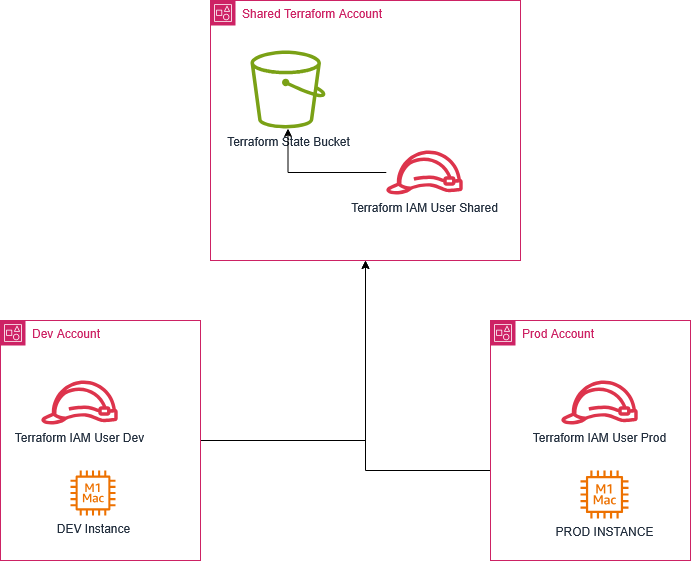

Recently, I had the opportunity to set up the Terraform Backend on AWS for an organization running several workloads. I realised that there's been a few changes to how the Terraform backend on AWS can be set up.
One of the major changes is that Dynamo DB is not needed anymore for state locking, instead Terraform now uses S3 for state locking. While incorporating this into the solution, another requirement became very clear: the Terraform backend needed to be centralised into one account so that the team would not have to maintain separate backends for each environment.

In this case this was their preference, other teams may prefer to have a backend S3 bucket set up for each account they have on AWS. With the centralised approach, the main issues that arise are:
* Managing cross account permissions/ access for the Terraform backend.
* Being able to utilise exisitng IAM permissions or roles in an existing workload account (to deploy resources via Terraform)
* Managing multiple providers for each different AWS account in Terraform

## The solution 


Let's walk through the proposed solution and it's components

### Central/Shared Account

The central account will contain

* "TerraformBackendBucket" - An S3 Bucket that will be used by the Terraform backend
The S3 bucket policy will be updated to allow the IAM role for Terraform - TerraformBackendRole to read and write to the bucket. 
ie. `s3:GetObject` and `s3:PutObject` permissions.

* "TerraformBackendRole" - An IAM Role with permissions to READ and WRITE only to the bucket.
The IAM Role's trust policy should be updated with the following JSON:
```{json}
{
  "Effect": "Allow",
  "Action": "sts:AssumeRole",
  "Resource": ["arn:aws:iam::<workload1-account-ID>:role/TerraformWorkload1Role",
                "arn:aws:iam::<workload2-account-ID>:role/TerraformWorkload2Role"
  ]
}
```
As the workloads increase, the number of resoruces in the trust policy will increase. If you want a more relaxed approach, the below trust policy can be used.
```{json}
{
  "Effect": "Allow",
  "Action": "sts:AssumeRole",
  "Resource": ["arn:aws:iam::<workload1-account-ID>:root",
                "arn:aws:iam::<workload2-account-ID>:root"
  ]
}
```
This allows anyone from the workload accounts WorkloadAccount1 or WorkloadAccount2 to run STS AssumeRole on the TerraformBackendRole to access the shared backend. The use case for this is mainly for ReadOnly users or large teams who want to test using AWS CLI on their local machines. However users will need permissions to assume this role with their credentials. In this usecase, teams will not have additional admin for each new user added to the workload account that needs Terraform access.


### Workload Accounts 

The workload accounts contain:

* An IAM Role that is used by that workload pipeline to deploy infrastructure.
Let's assume the IAM role for a CICD pipeline already exists with permissions to create required resources in the account. In this case we can update the role to have this policy attached:

```
Statement: [{...existing statements}{
    Effect: Allow,
    Action: "sts:AssumeRole",
    "Resource": "arn:aws:iam::<shared-account-number>:role/TerraformBackendRole"
}]
```
Once this is added, the role should be able to assume the TerraformBackendRole to access the s3 backend bucket.

* Any other workload components like an ec2 instance, etc.

## Digging deeper into the code

On the Terraform side, the backend.tf looks something like this:

```
>>> backend.tf
terraform {
backend "s3" {
    bucket="TerraformBackendBucket"
    use_lockfile=true
    key="Workload1WebTeamTerraform"
    region="ap-southeast-2"
    encrypt=true
    assume_role = {
        role_arn="arn:aws:iam::<shared-account-id>:role/TerraformBackendRole
    }
}
}
```
This automatically tries to run an AssumeRole on TerraformBackendRole in the background. It also allows us to separate backend access from anything the workload needs access to. The main magic is in the last 3 lines, where the ARN for the centralised IAM role is passed to the backend. This is only used for backend state management.
Finally, we do not need to use any additional aliased AWS providers with the Terraform setup. The backend file is mostly plug and play for any additional workloads in the Workload AWS account.
Bear in mind, the terraform S3 backend path should be updated if many different Terraform codebases - say a) Workload1DataTeamTerraform and b) Workload1WebTeamTerraform - deploy to the same account.

## Potential Improvements

There are some potential improvements for this solution:

* The S3 bucket can be shared across the AWS Organization which may eliminate the need for cross account roles, however, I have not tested this yet.
* Limiting the workload roles to access specific folders on the Terraform state bucket so that other workloads arent accessible by accident.
* MFA Delete on the S3 bucket to prevent the bucket objects from being deleted, explicit Deny on the IAM Role(s) to prevent deletion will also help.
 
## TLDR

TLDR: In this blog we discussed an approach to centralising AWS Terraform states to one account and accessing it from multiple workload accounts. This usecase can be used for large AWS organizations on AWS that want to centralise Terraform state management to a single AWS account. It utilises cross account role permissions to create a versatile backend.tf template that can be used across workloads once the solution is set up.
