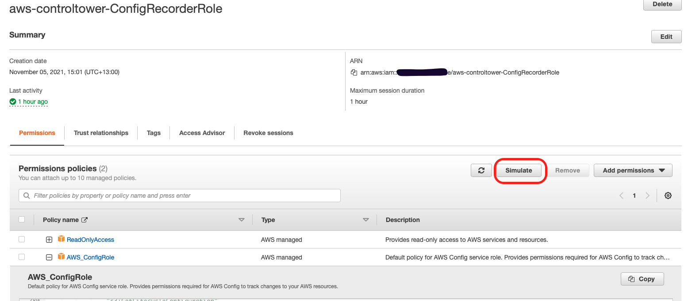
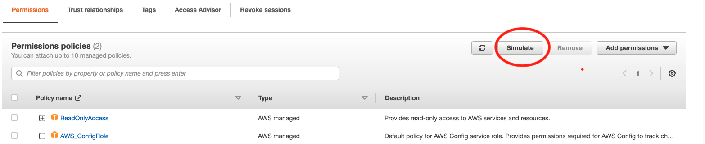
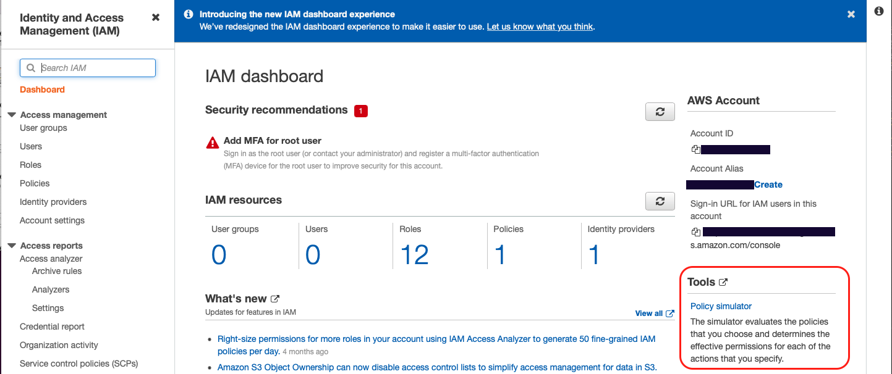
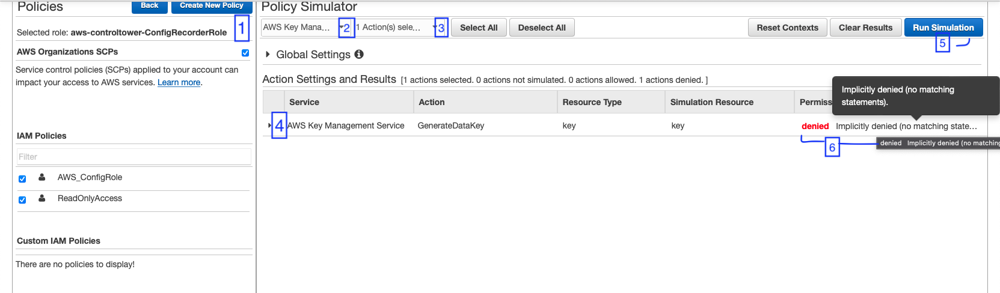
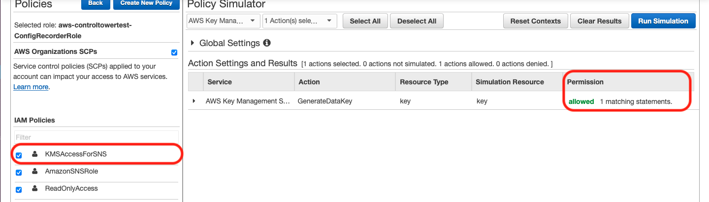

In this blog, we'll discuss debugging AWS IAM Policies and KMS Policies using a tool I didn't notice earlier.

The other day I was having some trouble debugging some issues with AWS Config throwing "Access Denied" errors.
I asked a senior engineer from my team to help me debug this issue. After debugging the issue a bit, we realised that the AWS IAM Role attached to AWS Config was trying to use KMS to encrypt data and did not have access to the key.
My coworker then introduced me to the IAM Policy Simulator which allowed me to debug and recitfy the IAM permissions quickly.

I have set up a test environment to showcase the IAM Policy Simulator's capabilities.

AWS Resources:

- AWS Config, set up using the one-click option. _Note -  In this scenario, we only use this to get the IAM Role. You can create a dummy role to test the IAM Role/Policy._
- A Symmetric KMS key with some permissions that allow some SSO Users to use it.

The AWS Config recorder is using the following role:



This role gives my AWS resource, in this case my AWS Config Recorder, the following AWS Managed permissions:

- Read-Only access to AWS Services and resources
- A Default Policy for the AWS Config service so that AWS Config can track changes across my acount.

The KMS Key is set up with the following permissions:

```{json}
{
    "Version": "2012-10-17",
    "Id": "key-consolepolicy-3",
    "Statement": [
        {
            "Sid": "Allow access for Key Administrators",
            *REDACTED*
        },
        {
            "Sid": "Allow Config to use this key",
            "Effect": "Allow",
            "Principal": {
                "Service": "config.amazonaws.com"
            },
            "Action": "kms:GenerateDataKey*",
            "Resource": "*",
            "Condition": {
                "ArnLike": {
                    "aws:SourceArn": "arn:aws:iam::**********:role/aws-controltower-ConfigRecorderRole"
                }
            }
        }
    ]
}
```

You can see that this key already has permissions to allow the above topic to run `KMS:GenerateDataKey*` using the key.

Jumping back to the `aws-controltower-ConfigReecorderRole` on the AWS IAM Dashboard, you can see a button that says **Simulate**.



If you click this, it will take you to the IAM Policy Simulator. Alternatively, you can jump into the Policy Simulator from the IAM Dashboard here.



Once you are on the Policy Simulator Page, you can select

1. The IAM User, Group or Role to use.
2. The Service you need permission to.
3. Specific Service actions you would like to use.
4. Action settings -  you can provide resource ARN's here.
5. Run the Simulation
6. View the Simulation results.



A simulaton has already been run in the above screenshot. You can see the `Access Denied` result with some additional information.

Now I have enough information to create a custom IAM Policy I can attach to this role. I can also quickly test the custom policy on the role using the simulator.

Here's a result once the right policy has been attached.



IAM Policy Simulator allows you to quickly debug and test IAM Policies attached to IAM Users, Groups or Roles against specific AWS resources. It saves time spent in manual testing by making this action one-click with instant results and is highly customizable.

Big thanks to Martin Caarels, you can check out his blog [here](https://blog.caarels.com).
