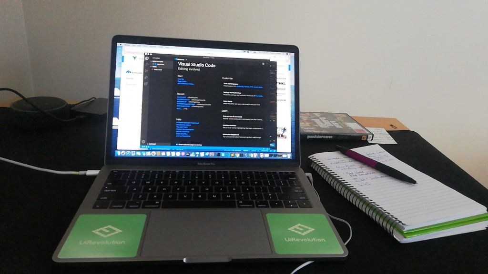

This month, I've been fortunate to continue my software development internship, working from home for [UiRevolution](https://www.uirevolution.com).

Covid-19 has changed the way humanity lives daily life. With lockdown in New Zealand, my company adapted to start working from home. This past month has taught me a lot and working from home has been an interesting experience. 

Here's what my desk setup looks like!

It's quite close to a minimalist setup as it can get messy if I start keeping more stuff on my desk...and yes that's a copy of GTA 4, my trusty notebook and Alexa in the background (disconnected, unfortunately :'( ). The only thing that did not come in this shot is the coffee cup. 

### With that in mind, here's 5 things I learnt working from home.

#### 1. Cache the caffeine!
 Coming from a self-proclaimed caffeine addict, a daily supply of some good tea and coffee is essential for the human brain and body. I've found myself grabbing quite a few drinks with and without caffeine, this may not be the best thing to do but it has certainly been helpful for me. Be it Melbourne Breakfast Tea, Hot chocolate, a protein shake, or some instant coffee they're always making the day more delightful!

#### 2. Social distancing ≠ online distancing.
 UiRev has daily meetings online that have kept the work environment going even at home. Keeping your communication channels open and actively monitoring them is important. Also, don't forget to reach out to work colleagues or friends for a chat. Remember, we're all in this together! 

#### 3. Find yourself a dedicated workspace/ work area.
 *I cannot emphasize this one enough.* A dedicated workspace will help you keep that area of home just for work. I took the first week experiencing the couch, the dining area, and the desk in my room. Make yourself comfortable as this is important to get the brain juices flowing.

#### 4. Create a schedule, even if it is a very basic one.
 Yeah, you have a lot of freedom at home, you can work from the couch or cook chicken while on a call. But remember, creating and sticking to a schedule will help you keep the mindset of being in work when working from home. *Work desk from 9 to 5 and gaming zone from 5 to 9 ;)*

#### 5. No discipline means you're entering the danger zone. 

This one comes from experience too. There are enough distractions around but keep yourself focused. Don't let the internet distract you even though Netflix or YouTube are just a few clicks away. Just one distraction is enough to break the attention.

Stay safe and see you in the next post.

*Note: All GIFs are from [Giphy](https://giphy.com).*